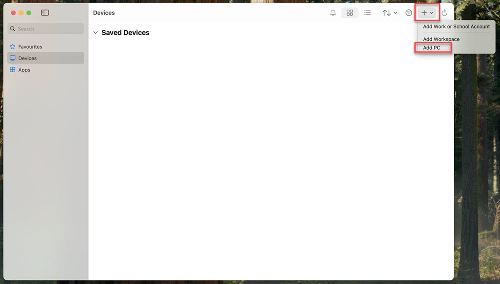
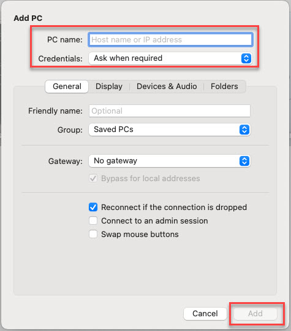
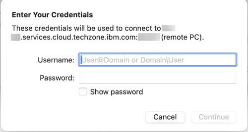
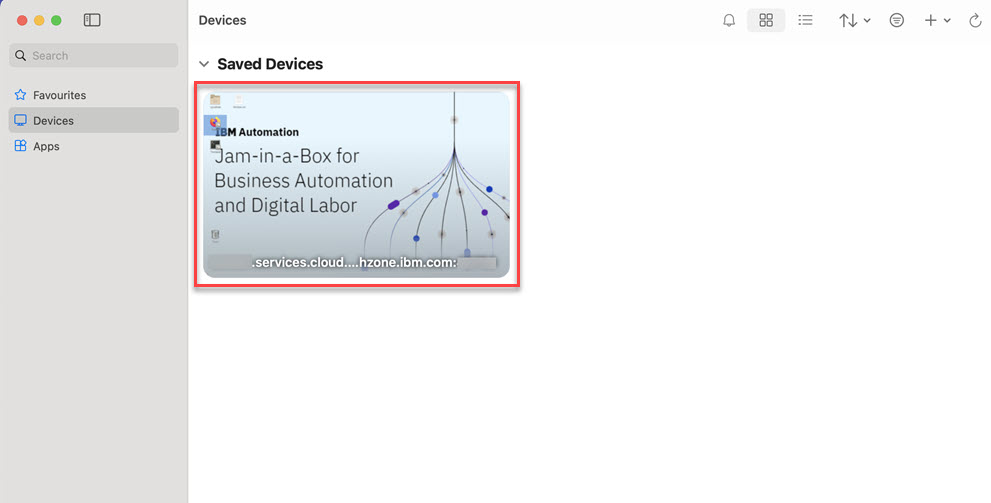
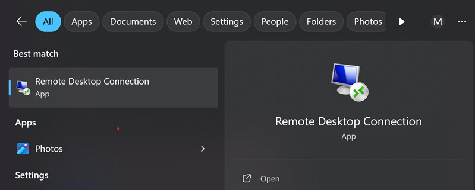
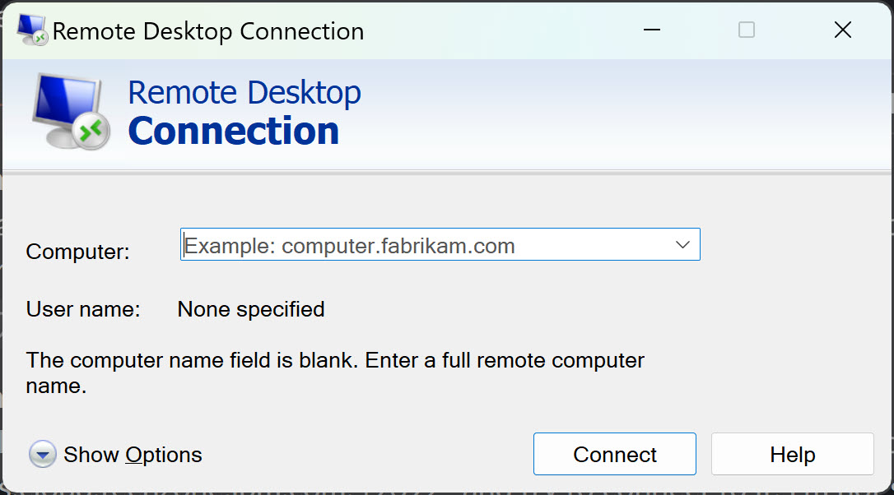
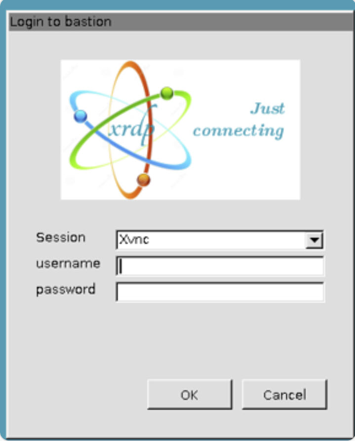

# Accessing the Bastion Host of a Jam-in-a-Box - Single User Environment via Remote Desktop Protocol (RDP)

## General

Access to a **Jam-in-a-Box Single User Environment** requires to connect to the bastion host via RDP. It cannot be accessed directly from your local browser.

This page provides hints on how to access a [Jam-in-a-Box Single User Environment](README.md) via RDP from both Mac and Windows.

## Mac Users

Mac users normally need to download and install a separate application to be able to connect to a remote system via RDP. While multiple applications exist, below instructions showcase how to use **Windows App** from Microsoft as a free option (the previous version of the application was called Microsoft Remote Desktop).

1. In case not already installed, download and install <a href="https://apps.apple.com/us/app/windows-app/id1295203466" target="_blank">Windows App</a> through your Mac App Store

2. Open Windows App and click the **+ sign** in the top right corner, followed by **Add PC**
   

3. Enter the RDP URL of your environment as **PC name** in the *Add PC* dialog. In the **Credentials** field, leave **Ask when required**. Afterwards, click the **Add** button
   

4. In the **Enter Your Credentials** dialog, enter the credentials that were provided to you and click **Continue**
   

5. Once you added a PC, a tile is created on the main page. To access the environment later on, click on the tile

## Windows Users

Windows users should have the Remote Desktop Connection app pre-installed on their machine, with no need for any additional installation.

1. **Click** on the **Search** icon in the taskbar and **type** *Remote* which should result in the app to be found
   

2. Enter the RDP URL of your environment as **Computer** in the dialog shown when launching the App and click on Connect leaving all other settings unchanged
   

3. Once connected to your environment, **enter** the **username** and **password** in the login dialog **Login to bastion**

## Support

We aim to support successfully utilizing our Jam-in-a-Box.

**Business Partners (require an invitation) and IBMers**

To engage us, drop us a message at <a href="https://ibm-cloudpak-partners.slack.com/archives/C04SMFNLA3T" target="_blank">#jam-in-a-box-ba-dl</a>.

**All others**

For anyone who doesn’t fall into the business partner or IBM employee category, please feel free to open a new issue on our <a href="https://github.com/IBM/cp4ba-jam-in-a-box/issues" target="_blank">GitHub repository</a>. We’ll be more than happy to address your questions and concerns there.

## Disclaimer

The information, tools, and artifacts describes and linked are provided AS-IS and without any warranty. Please also refer to the license that is part of this repository for details.
