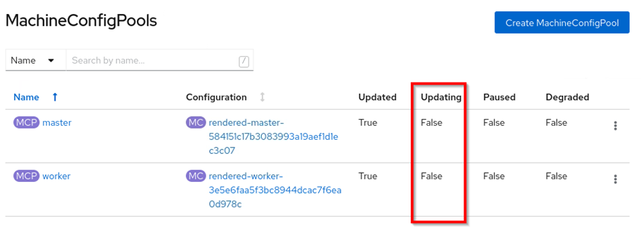
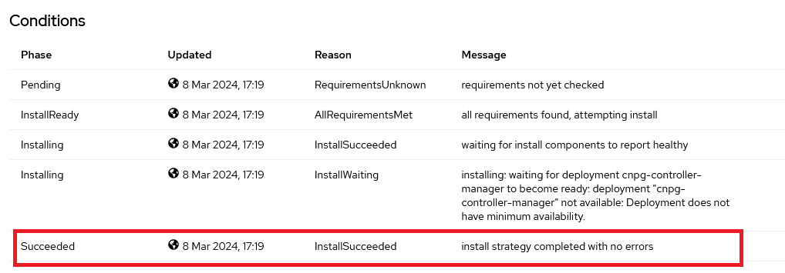
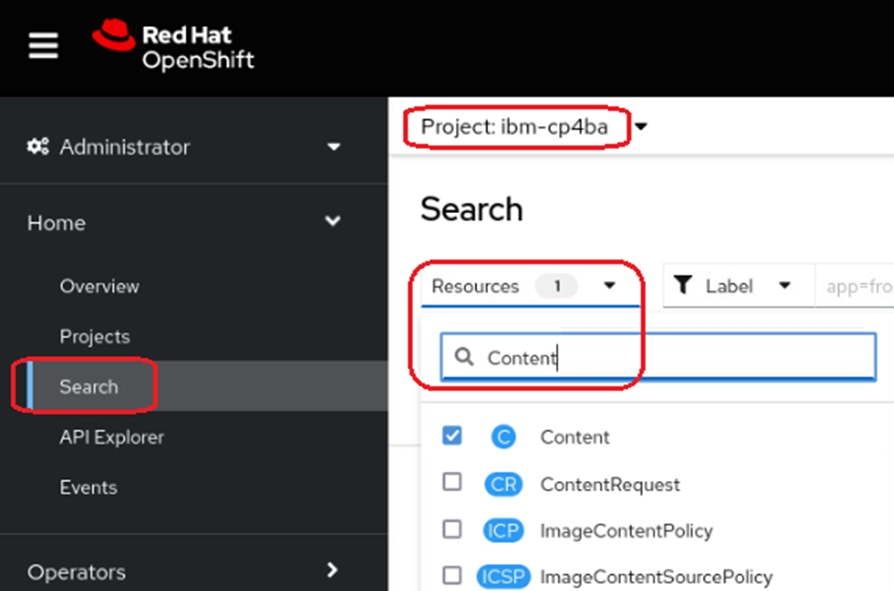

# Appendix A: Troubleshooting CP4BA

## A.1 Introduction

When you finish the previous exercise, you are ready with the deployment of Cloud Pak For Business Automation. However, you might have run into troubles or might be interested in how to 
further troubleshooting can be made for the deployment of a Cloud Pak For Business Automation deployment. Also, during the exercises above, you might have been referred to one or more of the sections in this chapter for troubleshooting problems, or checking the availability of components. 

## A.2 Determining Deployment Status of the CP4BA Cluster

This section shows how you can check the correct installation of the various parts of the CP4A deployment steps. Use it as a guide to check where you are with the deployment and whether anything failed to install.

First, performing any action while the Openshift cluster is being upgraded should be avoided. Therefore, before running any other task, determine if the Openshift cluster is currently being upgraded, and perform the following steps:

1.	Open the Browser and use the bookmark to log in to the Openshift Web Console. Login using **ocpadmin / passw0rd**, the thir-last character of the password is a zero.

2.	On the left navigation bar open the section **Compute** and select **Machine Config Pools**.

3.	Verify on the right side if you see **true** on the column **Updating**.

    
	
One of the first activities for CP4BA deployment is running the cp4a-clusteradmin-setup.sh script. When the script terminates, the CP4BA Operators might not be fully installed. Please check:

1.	Open the Web Browser and use the bookmark to log in to the Openshift Web Console. Login using **ocpadmin / passw0rd**.

2.	On the left navigation bar, open the **Operators** section and select **Installed Operators**. Then select the project **ibm-cp4ba**.

3.	Check that all of the operators show Status **Succeeded**.

After the clusteradmin script was executed, for preparation of the prerequisites, the **CloudNativePG** Postscript operator is installed.
To determine if the PostgreSQL Operator is currently being installed or the Postgres cluster is being configured do the following:	

1.	Open the Browser and use the bookmark to log in to the Openshift Web Console. Login using **ocpadmin / passw0rd**.

2.	On the left navigation bar, open the **Operators** section and select **Installed Operators**.

3.	Then select the project **ibm-cp4ba**. The **CloudNativePG** Operator should be there and show Status Succeeded. If that's not the case, it might still be installed.

	
	
4.	Then open the CloudNativePG Operator, and scroll to the bottom of the Details tab. At the bottom of it you should see the following if the Operator is already fully installed:

	
	
5.	When the CloudNativePG Operator is completely installed, the next step would be to install a PostgreSQL database server. To check the PostgreSQL Status using the CloudNativePG Operator, go to the All instances tab and verify the Status of the postgres cluster. When the Postgres Cluster is deployed, the state should show as **Cluster in healthy state**, as here:

	
	
	
When the prerequisites are setup, and the `cp4a-prerequisites.sh` was successfully executed in validate mode, the CP4BA cluster CR will be applied to the OCP environment. The CP4BA deployment uses either the resource type **ICP4ACluster**, or the resource type **Content**, depending on the components which were selected during the deployment. 

1.	Switch to the **Firefox** window, and login to the **Openshift Web Console**. Open the **Home** menu, and select **Search**. Make sure you use the **ibm-cp4ba** project. Click on **Resources** and type in **Content**, if "only" FileNet components were deployed, or type in **ICP4ACluster** if also other components were included. Press return to display all custom resources for the "Content" or "ICP4ACluster" Custom Resource Definition, in project ibm-cp4ba.
	
    	
	
2.	Click on the object which comes, the name will probably be "content" or "icp4adeploy". On the lower part of the screen, the conditions of this deployment are listed. The deployment is complete when the row with Type "Ready" reaches status "true", as outlined below.
 
        

3.	For further troubleshooting, use the script [deploymentStatus.sh](LabData/deploymentStatus.sh). By right-clicking the **Raw**  button the script can be saved to a local directory and executed. On a healthy environment it should print following output for a Content deployment:

    ```
    --------------------------------------------------------------
    
    Content CR named content found
    Custom Resource of type Content is applied
       Running      True    Running Running reconciliation
       Ready        True    Successful
    
    ZenService Deployment Progress: 100% (The Current Operation Is Completed)
    ZenStatus: zen operator 5.1.1 build 37:  Completed
    
    Foundation:
            Running reconciliation
            Prerequisites execution done.
    
    Initialization Status:
    {
            cpe_initialized: True,
            cpe_os_number: 2,
            css_initialized: True,
            nav_initialized: True
    }
    
    IAM Login details: cpadmin / <password>
    ````    	
    
	