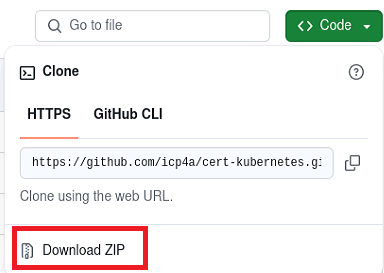
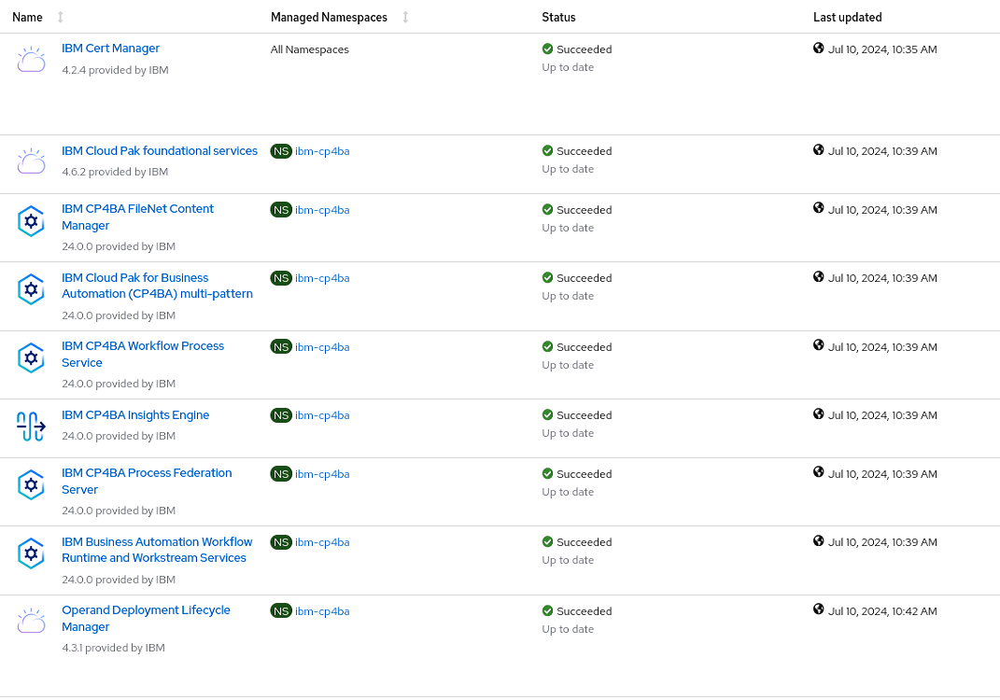
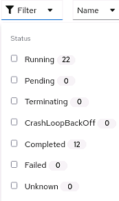

# Exercise 2: Deploy the CP4BA Operator

## 2.1 Introduction

To install the Cloud Pak 4 Business Automation, two modes are available. The **Starter** type deployment is useful for demonstrations, and includes the deployment of most prerequisites such as LDAP Server, Users and databases. Tn this Lab guide however the **Production** deployment type is used instead, which can also be used for demonstrations, but is primarily meant for deployments, which are used in development, test and production environments of customers. Further restrictions of the Starter type of deployment are that Air-Gapped installations are not supported, and not all CP4BA components can be used in this mode. The procedure for a Production type of deployment is described in the knowledge center in the "Installing Production Deployments" section, available from https://www.ibm.com/docs/en/cloud-paks/cp-biz-automation/24.0.0?topic=installing-production-deployments.
 
In Production deployments, separate installations of the databases and an LDAP server are needed, but since Version 24.0.0 the EDB Postgres Operator can automatically be invoked to create the required databases. However, the installation of the databases can also be done separately which will be covered in a later exercise in the lab environment used for the Bring-Up-Lab. The LDAP server has been pre-installed, along with definitions of users and groups.

For the installation, the **case package** is only needed, if deployment should be done from the commandline, and the Kubernetes / Openshift environment to deploy into is air-gapped. It is available for download in Github. The case package is maintained by the IBM Product Development teams, and contains a list of images, which might be needed during deployment of CP4BA, and is required to setup a custom docker repository for the deployment of air-gapped environments. Since Version 24.0.0, the scripts package is separately available in the <a href='https://github.com/icp4a/cert-kubernetes' target = '_blank'>cert-kubernetes repositoy</a>. The links to the case packages can be found on the "Cloud Pak for Business Automation Interim fix download document", which is available from https://www.ibm.com/support/pages/node/6576423. 

For the successful deployment of Cloud Pak for Business Automation, apart from Database and LDAP Server, File Systems to store configuration, logfiles, possibly also documents or fulltext search indexes are needed.  Openshift maintains those filesystems through Persistent Volumes and Persistent Volume claims, which could, at least for the Cloud Pak for Business Automation components, be created manually to fulfil special requirements. One example usecase for this is the creation of persistent volumes of type `hostpath`, to be able to mount more than one filesystem, in case a customer using a large number of FileNet File Stoage Areas wants to migrate to Containers. For persistent volumes which are not pre-allocated, a Storage Class can be used to automatically create Persistent Volumes for any volume claims created during the deployment. A suitable Storage Class has also been provided with the Lab environment, this is checked in one of the steps below.

For the main deployment of the CP4BA Operator, the documentation lists different possible solutions in the section "Setting up the cluster", available at https://www.ibm.com/docs/en/cloud-paks/cp-biz-automation/24.0.0?topic=deployment-setting-up-cluster. In this lab, the approach to "Setting up the cluster by running a script" is used, which performs the required steps for creating the project, setting up the operator user account, deploying the cert manager and license manager, creating the secret for accessing the container library and finally setting up the CP4BA Operators. Those steps can be done separately too, in case a customer requires it. The alternative would be a more graphical deployment through forms which need to be filled out on the OCP Administration GUI.

> **Note about Air-Gap deployments**: This refers to the installation of Cloud Pak 4 Business Automation in environments, which have no access to "the internet", and thus cannot use the IBM Container Library and other Container registries directly for deployment. Since Version 23.0.2,
 CP4BA now supports version 3.0 of the Air-Gap, through deployment of an addon to the Openshift commandline program "oc".

> In Air-Gap deployments, usually a local registry is used, and images from the IBM Container library are copied into that local registry. Furthermore, Openshift is configured by using an Image Content Source Policy, to request openshift to search the local registry whenever specific images (specified through their SHA256) are referenced from the IBM Container library.

> When copying the images to the local registry and setup of the Image Content Source Policy have completed successfully, deployment of an Air-Gapped environment can be done mostly like a regular, non air-gapped one.

The exercise instructions in the following paragraphs will guide you through the download and unpacking of the case package. Scripts available in the cert-kubernetes repository are then used to deploy the Cloud Pak 4 Business Automation operators, the Licensing Operator and the Certificate Manager Operator into the Openshift cluster. Correct installation is reviewed in the following section called "Verification instructions".

## 2.2 Exercise Instructions

1.	Click on the tile for the Bastion host. Login as the "cp4badmin" user, if needed, the password is "passw0rd" with a zero.

2.	Open a Terminal, by clicking the link on the desktop. Create a directory to host the product deployment scripts. 
    ```sh
    mkdir cp4ba
    ```
	
3.	Open Firefox through clicking on the link on the desktop. Find the link for **Cert-Kubernetes Repository** in the Bookmark toolbar, and navigate to it, the URL is https://github.com/icp4a/cert-kubernetes. The cert-kubernetes repository contains different branches for the different versions of CP4BA. To obtain the download link, make sure the `24.0.0` branch is selected, then click on the green pulldown menu `<> Code`, and click on "Download ZIP". 

    

4.	Back on the terminal window, navigate to the cp4ba directory, and unpack the cert-kubernetes repository copy. 
    ```sh
    cd cp4ba
    ```
    ```
    unzip ../Downloads/cert-kubernetes-24.0.0.zip
    ```

5.  In order to not have to upgrade all of the instructions with every new ifix of CP4BA, lets make the name a bit more generic.
    ```
    mv cert-kubernetes-24.0.0 cert-kubernetes
    ```	
 
6.	Change into the cert-kubernetes/scripts directory
    ```sh
    cd cert-kubernetes/scripts
	```
	
7.  Before the operator can be deployed, a connection to the OCP cluster must be established. If you did the previous exercise immediately before this one, the connection should still be valid, nothing needs to be done. If not, use **Firefox** to login to the OCP Console application, then generate a login command, and paste it into the Terminal window, as shown in the last exercise.

8.  Verify, that on openshift a storage class has been created.
    ```sh
    oc get storageclasses
	```
	Expected output:
		

    > **Note about Storage Classes:** The deployment of openshift supports three file-based storage classes for slow, medium and fast storage. They can, but dont need to be different, so here we will use the same one for all three categories. 
    
    > Further, the CP4BA deployment supports a storage class used to request a block storage. However, the block-storage storage device will be mounted in the Pods in filesystem mode, in which case Kubernetes will transparently create a filesystem in the block storage device. Therefore, a single storage class for file-storage can be used instead for the installation, but it needs to support the access modes RWO and RWX. Read more details on https://www.ibm.com/docs/en/cloud-paks/cp-biz-automation/24.0.0?topic=classes-storage.
 
9.  Verify, that the ocpadmin user has indeed clusteradmin privileges. 
    ```sh
    oc auth can-i create project
	````
	Expected output:
    
 
10.	The deployment of the CP4BA Operators is performed by the `cp4a-clusteradmin-setup.sh`. The installation asks several questions. It could, in theory be automated by providing environment variables with answers to all the questions. This is not done here, so expect to answer the questions following its invocation.

    Start the deployment of the CP4BA Operator by running the clusteradmin setup script.
    ```sh
    ./cp4a-clusteradmin-setup.sh
	````

11. Choose Online Based CP4BA Deployment (not an Air-gapped one), so select **1**.

    
	
12.	Select the correct type of environment, when the script asks for it. This environment uses an Openshift-environment on Private Cloud that is not ROKS, so select **2**

    
 
13.	Select the type of deployment to do. In this lab we will create a Production type deployment, so select **2** again.

    
 
14.	For the question whether to check the nodes if they are FIPS compliant, select **no**.

15. The next question asks weather to deploy CP4BA environment using private (namespace based) catalog sources, or using the global catalog source. The global catalog will ultimately limit the possibilities, to run different versions of CP4BA within the same Openshift cluster, hence use namespaced catalog sources, select **yes**.

16. Furthermore, the operators can be deployed into their own namespace, different from the namespace of the CP4BA deployment. On the usage will  require switching between the namespaces a lot, so lets not do that for now, and select **no**.

21.	For the question, into which Openshift project the CP4BA should be deployed, answer **ibm-cp4ba**.

    
 
22.	On the next question, a user needs to be selected  . Select the user **ocpadmin** as well, by typing in the number, which is displayed in front of his name. 

23.	When the system is querying on the CP4BA Entitlement Registry key, copy the displayed link into the clipboard. Then select the **Firefox** browser and open the link in a new tab. On the page of the Knowledge Center, click on the link to **My IBM Container Software Library**. 

    **Note:** To avoid entering your credentials to the IBM Container Library in the bastion host, you can also do this on your local machine, and copy over the entitlement key to the bastion host using the Clipboard.

24.	After logging in to your IBM account, please verify that you have access to "Cloud Pak 4 Business Automation" software, by clicking the "Container software library" entry on the left side. Then select the "Entitlement keys" entry on the left side, and copy one of the still valid entitlement keys to the clipboard.

25.	Back on the Terminal window answer **Yes** to the question whether you have an entitlement registry key. Then paste the key from the clipboard, when prompted.

    
 
At this point, no more questions need to be answered, and the script begins installation of the Cloud Pak 4 Business Automation Operator. It starts by installing the cert manager and the licensing manager, each into its own namespace. Then it installs the CP4BA Catalog Sources into the OCP cluster, followed by installing the CP4BA Operator into the ibm-cp4ba project. 

The script can take between 15 minutes to half an hour to complete.

**Note:** If deployment of the cert manager and/or licensing manager take longer than expected, it might be that the `cp4a-clusteradmin-setup script.sh` script is aborted with an error message. In this situation it can help to await the existance of running instances of the cert manager and/or license manager , and then re-run the `cp4a-clusteradmin-setup script.sh`. The script will detect existing deployments of the cert manager and/or license manager and skip deployment of already deployed components.

## 2.3 Verification Instructions

When the script finishes, it should have installed the CP4BA Operators. 

1.	Change to Firefox, and login to the Openshift Web Console as ocpadmin, using password passw0rd, with a zero. To verify the operators' deployment, select the menu entry **Installed Operators** on the left-hand side within Operators.
    
	
 
2.	At the top left side of the main pane, switch to project **ibm-licensing**.

    
 
3.	Verify that the following **two operators show Status Succeeded**.
 
    
	
	
4.	Change project to **ibm-cert-manager**.
 
    
	
5.	Verify that the following operator shows Status **Succeeded**.
 
    
	
6.	Change project to **ibm-cp4ba**.
  
    
	
 
7.	Verify that the following nine operators show Status **Succeeded**.
 
    
	
    > *Note:* In different CP4BA versions, you may see more or fewer operators.

8.	Select on the left-hand side within **Workloads** the menu entry **Pods**.
 
    
 
9.	Click on the Filter dropdown menu and verify that all pods are either in **Running** status, or **Completed**, none should be Pending or in a CrashLoop.

    
    
    > Note: In different CP4BA versions, You may see more pods.

Congratulations, the Cloud Pak 4 business automation operators, as well as the LicenseManager and CertManager operators seem to be installed properly. So lets continue with preparation steps for the CP4BA deployment. Refer to [Exercise 3: Prepare Deployment](Exercise-3-Prepare-Deployment.md) for details.
