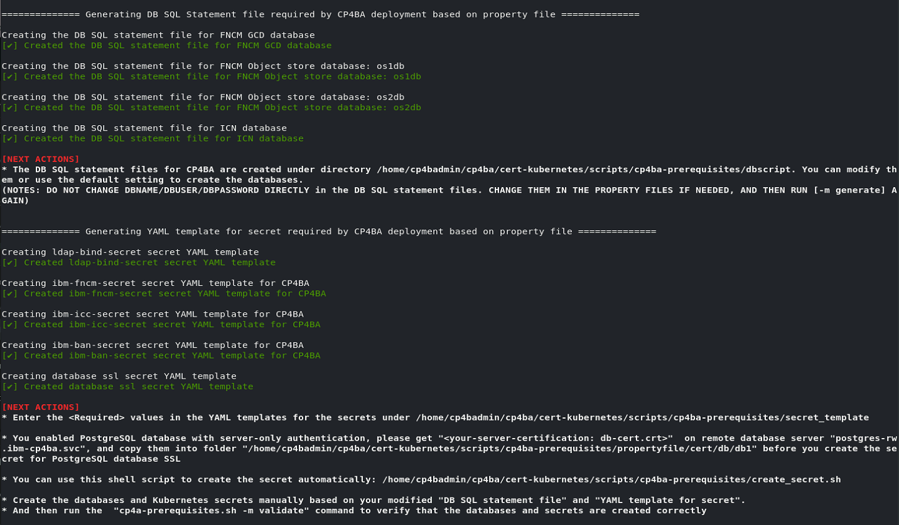
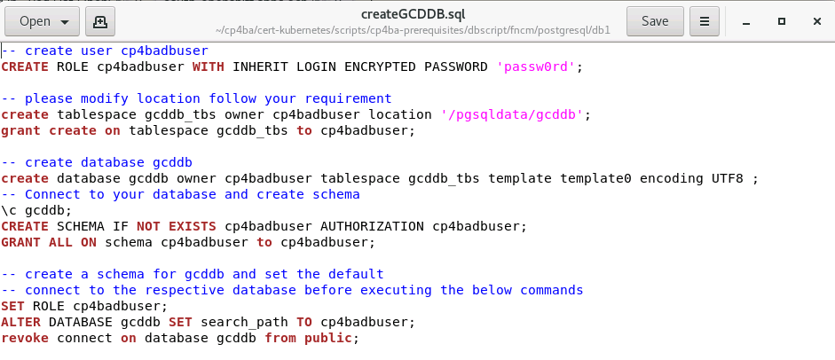
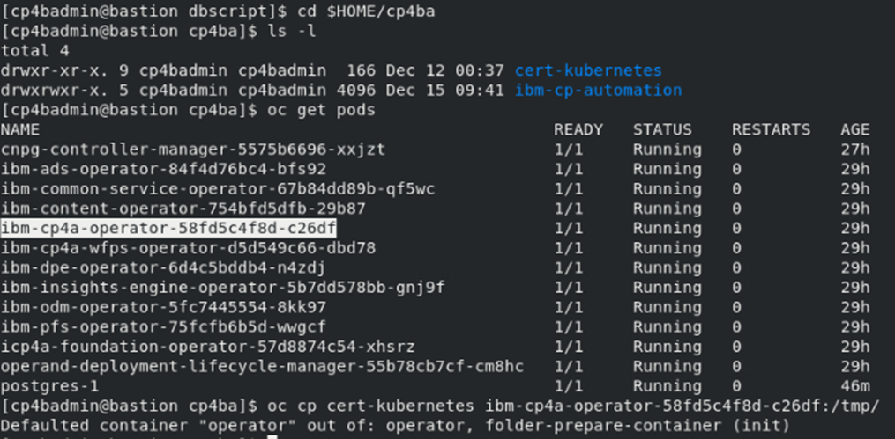
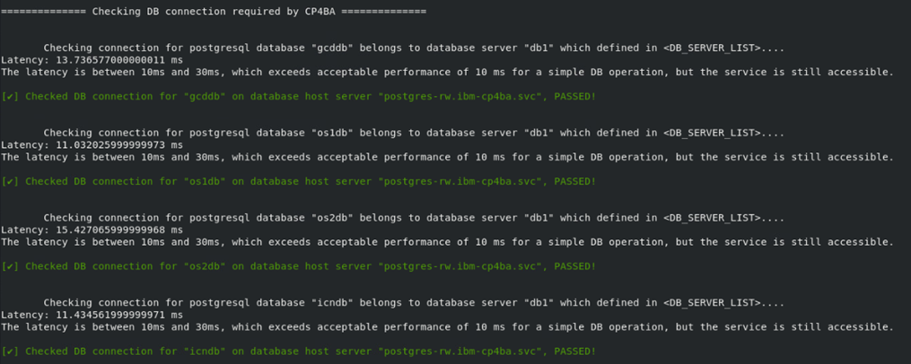

# Exercise 6: Generating CP4BA Databases and Verifying Configuration

## 6.1 Introduction

In the last two exercises, the configuration parameters in the property files created by the `cp4a-prerequisites.sh` script, have been set to the required values. This is a required precondition for 
running the `cp4a-prerequisites.sh` now in **generate** mode. In this mode, the script will first review completeness of the configuration variables, and will then generate the required Kubernetes secret definitions, as well as sql scripts to create the databases on the PostgreSQL database server.

The PostgreSQL database creation scripts need to be copied into the PostgreSQL database server. They need some manual modifications, as PostgreSQL deployments in different environment might differ from each other. The DB scripts can be transferred, edited and executed one by one, or as its done here, uploaded to and executed on the PostgreSQL pod via one shell command. 

Applying the Kubernetes secrets is easy, it can be done using the steps indicated here. Alternatively another script from the case package can also be used.

In the verification section of this Exercise, the `cp4a-prerequisites.sh` script run in **validate mode**, to validate the configuration and deployment of the prerequisites. As the connection to the database is also verified, and as the database can only be reached from inside the Kubernetes cluster, the checks cannot be run directly on the bastion node, without giving error messages from the unavailable database server. Therefore, to run the validation, the deployment scripts directory is copied into the `/tmp` directory of the CP4BA Operator, and run from there. 

## 6.2 Exercise Instructions

1.	Switch to the **Terminal** window. Change to the **cert-kubernetes/scripts** directory.

    ```
    cd $HOME/cp4ba/cert-kubernetes/scripts
    ```

2.	Run the **cp4a-prerequisites.sh** script in **generate** mode. In this mode, information configured in the property files is reviewed, and the CP4BA Configuration files are generated. 

    ```
    ./cp4a-prerequisites.sh -m generate
    ```

	If error messages are printed, get back to the last exercise and edit the two property files, to find any configuration value which still contains a `<required>` value.
	
    > Note When running it without parameters, the `cp4a-prerequisites.sh` script supplies a usage.
	
	> 
 
4.	The script does not ask for further input, in this mode. Result of checking the property files is indicated in green or red color, red color indicates errors or missing values. 

    Expected output:
	
	
 

7.	The database creation scripts are generated in directory **cp4ba-prerequisites/dbscript**, so change into that directory.

    ```
    cd cp4ba-prerequisites/dbscript
    ```
	
8.  List the database creation scripts that were generated, then invoke the editor with one of them, to review for any required changes.

    ```
    find . -name \*.sql -print
    gedit <first database creation script>
    ```

9.  In the opened editor, see that the database creation script will create the database user, with the passwords which were configured in the properties files. It will create one tablespace, and set 
    its rights to allow access by the database user configured earlier. It will then create a database, and a schema for the database user. It will then also configure a search path, to allow usage 
    of tables and views without prefixing them with the schema name, then revoke connection rights for any other user. 

    When reviewing the commands, it can be seen that that the tablespace is created in the wrong directory. The setting depends on the postgres deployment, which in this case uses a different directory 
    to persist the tablespaces. Find out which directory is the right one in the following step.

    

10. To find out the right directory, list the directories which have been mounted in the postgres pod. 

    ```
    POSTGRES=$(oc get pods -l app=postgres -o 'jsonpath={.items[0].metadata.name}'); echo "Postgres Pod is $POSTGRES"
    oc exec $POSTGRES -- df
    ```

    Review in the output that the "/mnt" directory seems to be mounted to some storage from outside the container image, for example.

    

11. Run the following command to have Openshift describe the Postgres pod. Look in the output for the listing of the mouted storage.

    ```
    oc describe pod $POSTGRES
    ```

    Find following part within the output (by scrolling up).

    

12. Modify the tablespace creation command in all database scripts. The loop iterates over all SQL creation scripts

    ```sh
    for sql in $(find . -name \*.sql -print); do echo $sql; sed -i 's/pgsqldata/mnt/g' $sql; done
    ```
    
13. Check the sql database creation scripts for the modified tablespace commands
    ```
    grep "/mnt" $(find . -name \*.sql -print)
    ```

13. For the tablespace creation commands to work, the directories containing the tablespces must exist. Open a shell in the Postgres pod and create the four directories.
    ```
    oc exec $POSTGRES -it -- bash -c "mkdir /mnt/{gcddb,os1db,os2db,icndb}; ls -lR /mnt"
    ```

8.	Then each of the database creation scripts needs to be copied into the PostgreSQL pod, and run from inside the pod. The following command does this. The command in the first line finds and loops over the sql files in the subfolders. For each of the files found, the next three commands are executed. The `done` command terminates the loop. It is recommended to copy & paste each line by itself.

    ```
    for sql in $(find . -name \*.sql -print); do
    echo Creating Database $sql
	oc cp $sql $POSTGRES:/tmp/dbscript.sql
	oc exec $POSTGRES -it -- psql -U pgadmin -f /tmp/dbscript.sql
	done
    ```

	Output should be similar to:
	
	
  
13.	Check the created databases with the psql command \l+

    ```
    oc exec $POSTGRES -it -- psql -U pgadmin -c '\l+'
    ```

    Expected output:

    
	
	In case the databases are created incorrectly, you can delete the Postgres cluster `oc delete -f postgres.yaml`, and recreate it `oc apply -f postgres.yaml`.
	Before trying to recreate the databases, copy the modified `postgresql.conf` file into the Postgres pod, and rerun Postgres by deleting the pod.
 
14.	The next step is to apply the generated secrets. Thankfully the secrets are ready and don’t need manual updating, and there is even a shellscript for defining them. 

    ```
    cd ../
    ./create_secret.sh
    ```

    Expected output:	
	
	
    > **Note:** Most secrets are also documented in the Knowledge Center, but it might not always be straightforward to find them there. Mostly, the names of the secrets can also be changed through definitions in the custom resource. The default names for some of them furthermore includes the name of the custom resource.

## 6.3 Validation steps
 
In this section, the `cp4a-prerequisite.sh` is executed in validate mode. This is an optional step, but highly recommended to verify consistency of the specification, and check for common problems.

In an environment with separate LDAP and separate database server(s), validation can also run successfully from the bastion host. However, if the database is running within the same Openshift cluster,
then it might only be reachable from within the cluster, and it wouldnt be possible to check connectivity to it successfully from the bastion host. Also in an Air-Gapped environment, you might want to run the validation 
from inside the Openshift cluster, to check for any additional allowances to access the Database and LDAP Servers from the Openshift cluster.
 
1.	As the database is reachable only from within the Openshift cluster, it is needed to copy the directory containing the scripts, including all of the property files configured earlier, into a pod. 
    Here we choose the ibm-cp4a-operator pod, as it has all required commands to execute the validation script. 

    ```
    cd $HOME/cp4ba
    oc get pods -l name=ibm-cp4a-operator
    oc cp cert-kubernetes <cp4ba operator podname>:/tmp/
    ```

    Expected output:
	
	
 
2.	Run a shell inside the Operator. Before we can run the validation script, the pathname of the certificate file directory needs to be corrected. Then you can run the validation script. At the beginning of its execution, some error messages on unavailable command tput and clear are printed. Those are not harmful.

    ```
    oc exec <cp4ba operator podname> -it -- bash
    cd /tmp/cert-kubernetes/scripts
	sed -i s@/home/cp4badmin/cp4ba/cert-kubernetes@/tmp/cert-kubernetes@g cp4ba-prerequisites/propertyfile/cp4ba_db_server.property
    ./cp4a-prerequisites.sh -m validate
    ```
    
Review the generated output. It checks not only the storage class, ldap settings and database settings, but measures also the typical connection delay to the LDAP server and the database. 

3. Expected output of storage class checking:
 
    

    With errors in this step, check if the right storage class names were provided, and whether the storage class is defined, by running `oc get storageclass`. With any updates, it needed to update the configuration, by re-running the prerequisite script in generate mode, see beginning of this chapter for reference.

4. Expected output of secret checking

    
 
    With errors in this step, please check if the files with the Kubernetes secrets were correctly applied, see last step of preceding section for reference.

5. Expected output of LDAP connection speed testing
 
    
	
	With errors in this step, check if the SDS is running, and whether the correct IP address and port number were configured in the properties files. If SDS is not running, or not responding correctly, it can be restarted by running `sudo systemctl restart sds`. If configuration files need to be updated, generate the configuration again, apply the secrets, and rerun these verification steps. If *only* the latency is bad, this can be ignored in this sample environment. In a production environment of a customer, this would need to be investigated properly.
	
6. Expected output of Database configuration and connection speed checking
 
    
	
	With errors in this step, determine if the databases are incorrectly created (run the psql command \l+), or if database server address or database user / password are incorrect. If its needed to recreate the databases, it might be needed to delete the Postgres deployment ``oc delete -f Postgres.yaml``.  Then follow steps above to recreate the databases. 
	
7.  Exit out of the Operator

    ```
    exit
    ````
	
Congratulations, with completion of this exercise, the required prerequisites for the deployment of Cloud Pak For Business Automation should be in place. In the [next exercise](Exercise-7-Deploy-CP4BA.md), the case package script `cp4a-deployment.sh` is used to generate the so-called *CR* (shorthand for Custom Resource). Applying that YAML file to Kubernetes will kick-start the deployment of the Cloud Pak For Business Automation.
