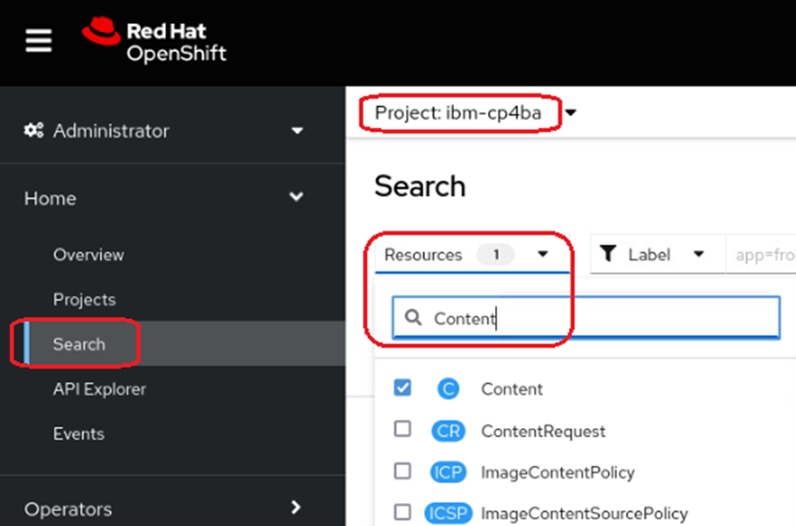
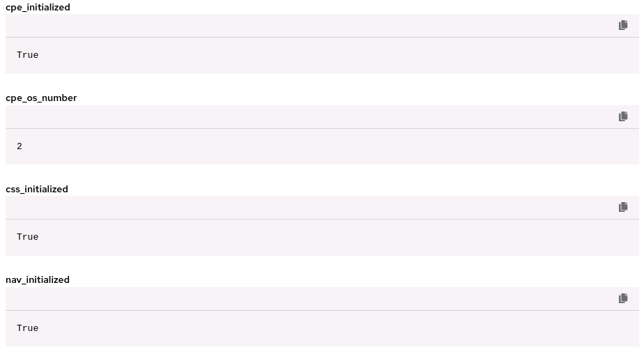
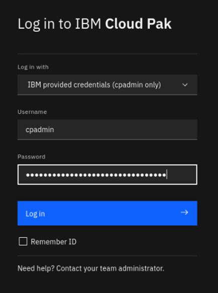
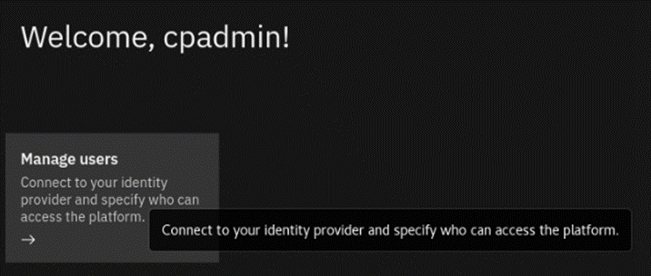
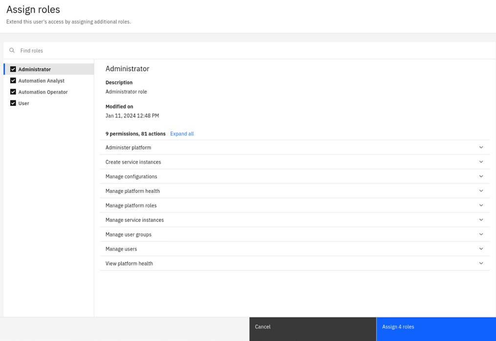
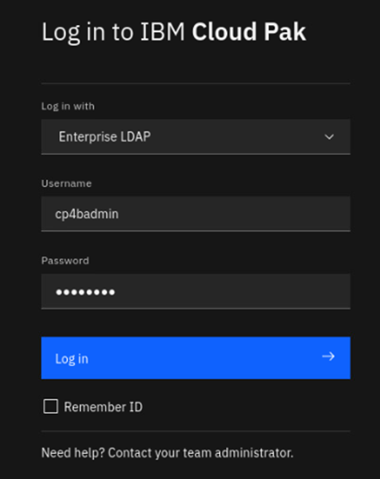
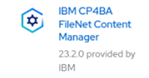
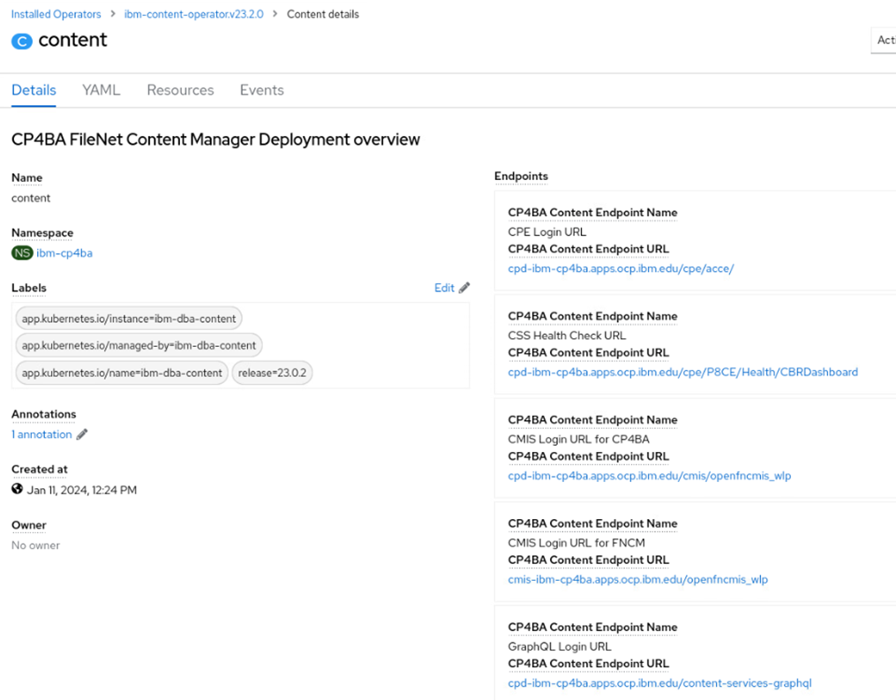

# Exercise 8: Post Deployment Steps / Deployment Verification

# 8.1 Introduction

In the previous exercises, the prerequisites for deployment of Cloud Pak For Business Automation have been setup, and a Content-deployment has been started. In this exercise it is shown how to determine, if the deployment is completed, or if errors have happened during the deployment. In the second part, required Post-Deployment steps are performed, and the URLs for usage of ACCE and Content Navigator are extracted from the Openshift Environment.

# 8.2 Exercise Instructions

1.	Switch to the **Firefox** window, and login to the **Openshift Web Console**. Open the **Home** menu, and select **Search**. Make sure you use the **ibm-cp4ba** project. Click on **Resources** and type in **Content**. Press return to display all custom resources for the "Content" Custom Resource Definition, in project ibm-cp4ba.

    
 
2.	This is displaying the same object as was generated and defined in the last exercise. Click on it. On the lower part of the screen, the conditions of this deployment are listed. The deployment is complete when the row with Type "Ready" reaches status "true", as outlined below.
 
        
 
3.	Open the **Workloads** section in the menu, and select the **Pods** menu. There should be **47 pods** now in running state, plus some in Completed stages. None should be in Pending or in CrashLoopBackoff state.

    		
	
4.  Open the **Configmaps** section, and use the filter to display the configmap with the name **content-initialization-config**. 

    
	
5.  Click on it to display its values. When you scroll down, you see that all the settings, cpe_initialized, css_initialized and nav_initialized are set to true. This means, that the initialization of the FileNet Content Platform Domain, and the Content Navigator was successful, i.e. the FileNet Domain and Object Stores were created, the Content Search Server configured, and Content Navigator initialized with Repository connections and Desktops.
	
	
	
	
4.  Optionally, for further troubleshooting, use the script [deploymentStatus.sh](LabData/deploymentStatus.sh). By right-clicking the **Raw**  button the script can be saved to a local directory and executed. On a healthy environment it should print following output:

    ```
    Content CR named content found
    Custom Resource of type Content is applied
       Running	True    Running Running reconciliation
       Ready        True    Successful
    
    ZenService Deployment Progress: 100% (The Current Operation Is Completed)
    ZenStatus: zen operator 5.0.2 build 41:  Completed
       2024-04-08T10:29:32Z Awaiting next reconciliation
       2024-04-08T11:03:37Z Last reconciliation succeeded
       2024-04-08T11:03:37Z
    
    Foundation:
            Running reconciliation
            Prerequisites execution done.
    
    
    
    Initialization Status:
    {
            cpe_initialized: True,
            cpe_os_number: 2,
            css_initialized: True,
            nav_initialized: True
    }
    
    IAM Login details: cpadmin / <password>
    ````    	
    
    
The following post-deployment steps described here follow the description in the knowledge center under "What to do next": <a href="https://www.ibm.com/docs/en/cloud-paks/cp-biz-automation/23.0.2?topic=cpd-option-1-installing-production-deployment-in-openshift-console" target="_blank">https://www.ibm.com/docs/en/cloud-paks/cp-biz-automation/23.0.2?topic=cpd-option-1-installing-production-deployment-in-openshift-console</a>

1.	Choose the ConfigMaps menu in the Openshift Web Console in section Workloads. In the search box, type in **access-info**, and find the **content-cp4ba-access-info**. This is one of the places where you can get the URLs of the deployed CP4BA components. 

    > Note that the access info page is one of the resources, those name is derived from the name of the custom resource definition.
	
6.	Next, choose the **Secrets** menu in the Openshift Web Console in section **Workloads**. In the search box, search for the secret named **platform-auth-idp-credentials**.  Click to open the secret, and then click on Reveal values. 

7.	Still in the Openshift Web Console, open section **Networking** in the menu and click on entry **Routes**. Find the route called **cpd**. It contains the link to the **Cloud Pak Dashboard**. Right click the link, and select Open in New Private Window. 

8.	If the environment is configured with self-signed certificates, you will need to accept the security exception (up to two times). Then select **IBM provided credentials** and login with the credentials from the  platform-auth-idp-credentials secret. 

    
 
9.	In the Cloud Pak Dashboard, click on the Manage Users tile

    
 
10.	The Access Control window opens. In the top right corner, there is a link to the Identity Provider Configuration window. There, the identity providers connected to the environment can be selected. Click on it, and note it has two entries, one for the LDAP, and one for the users defined on Openshift. 

    
 
11.	Use Browser-Back button to get back to the Access Control. Click the row with the cp4badmin user. 
 
    
 
12.	Click on the Assign roles button. The Assign roles window opens.  Assign all roles to the user, then click on the Assign 4 roles button in bottom right corner.

    
 
13.	Close the private browser window, and open a new one by right clicking on the crd route again, in the Openshift Web Console. Accept the self-signed certificate, if needed. 
In the login window, this time select **Enterprise LDAP**, and supply the administrator username **cp4badmin**, and password **passw0rd** with a zero. 

    
 
14.	The Cloud Pak Dashboard should open again now, allowing administration access also for the  cp4badmin user. Verify that the Manage Users tile is still visible.

    
 
15.	Leave the private browser window open, and get back to the Openshift Web Console. In the Openshift Web Console, choose menu entry Installed Operators from the Operators section.  Click on the Name of the CP4BA FileNet Content Manager Operator. 

    
 
16.	The Operator page opens. Select the **All Instances** tab. Here you see an alternative for checking on the deployment status. When the deployment is ready, the status column will contain the Condition Ready.

    
 
17.	Click on the content link. The CP4BA FileNet Content Manager Deployment overview window opens. It lists the configuration made previously through the Custom Resource Definition, and also includes links to the components.

    
 
18.	Copy the link to ACCE into the clipboard (right-click and invoke Copy Link), and paste it in the Private Window’s URL entry. The ACCE link has the name "CPE Login URL" in the list.

    No login should be needed, as the environment uses single sign-on through the Cloud Paks Identity Provider. In the opened ACCE window, verify that both Object Stores have been defined. 

    > Note: At this step you can investigate a bit yourself and look around. Determine for example if an Advanced Storage Area and an Index Area have been defined for the Object Stores.
	
19.	In the Openshift Web Console, copy the link to the Content Navigator. There are two, only the one with the name Navigator Login URL for CP4BA works. The other link is intended for other deployment types. Paste the link again into the Private Windows URL entry box (right click and select "Paste and Go")

Again, login will be skipped, and the Content Navigator desktop is shown. To arrive at the Administration feature, use the Hamburger menu in top left corner. Review that repository definitions for the two object stores have been created and that Desktop definitions have been made.

Congratulations, at this stage the deployment of the Cloud Pak For Business Automation is has been completed, and the environment could be handed over to a customer. 
